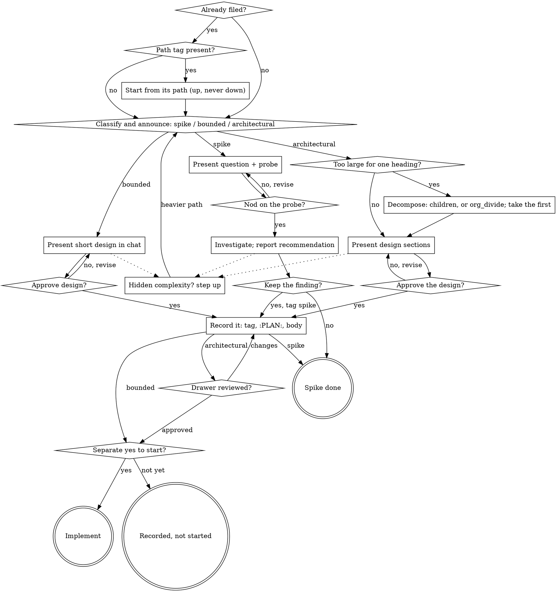

# Brainstorming Ideas Into Designs

Help turn ideas into fully formed designs through natural collaborative
dialogue, and record the result where this project keeps designs: the
`:PLAN:` drawer of a tracked heading, never a separate Markdown document.

Start by classifying how much process the request needs, then work
through your path: understand the context, refine the idea, present a
design, and get your human partner's approval.

*Inspired by and derived from the brainstorming skill of obra/superpowers
(v6.4.1; see `.upstream` and the folder's README), adapted to this
plugin's tracker and the org skill's conventions. Where the two differ,
this file governs.*

## Establish Shared Understanding

The outcome of brainstorming is an understanding your human partner can
recognize and correct, grounded in what they want to accomplish.

1. **Discover intent.** Use the request and available context to identify
   the intended outcome, who it is for, and what success looks like. When
   that information is missing, ask one focused question about purpose or
   intended use before proposing features or an approach. Gathering
   missing requirements does not ask them to authorize the task again.
2. **Write back your understanding.** Summarize the intended outcome,
   relevant constraints, and success criteria in a short note your partner
   can assess. Separate what they said from assumptions. Invite correction
   and incorporate their answer before treating this as the design brief.
3. **Carry intent into the design.** Preserve the agreed understanding in
   the selected path's design artifact: the heading's `:PLAN:` drawer for
   bounded and architectural work, the in-chat probe for a spike. Check
   proposed features and technical choices against that understanding.

When the request already supplies the purpose and constraints, reflect
that understanding instead of asking the same questions again. Keep the
note concise; its accuracy and the opportunity to correct it matter.

**Check the tracker before designing.** Run `org_outline` (or `org_query`)
for a heading that already holds this work; `org_capture` also lists near
matches when it files one. A design for work already filed belongs in
that heading's `:PLAN:`, not in a new heading.

## Where the dialogue runs, and where writes happen

**Not in Plan Mode** (the user, 2026-09-22). Plan Mode always writes the
plan to a file under `~/.claude/plans`, which is the retired plan-file
pattern, and its `ExitPlanMode` approval can only mean "start
implementing" or "stay read-only": there is no "record this and stop". A
session that tried it looped when asked to write the drawer. So hold the
dialogue in the ordinary session, read-only by the HARD-GATE below, and
do not call `EnterPlanMode` or `ExitPlanMode`.

**The design approval is an explicit yes in chat** to recording the
design you presented. Only after it: capture the heading with
`org_capture` (with an `initial_state`, a `category` when it is
top-level, and the path's tag in `tags`: `spike`, `bounded` or `arch`),
or re-tag the existing heading; then write the approved design with
`org_amend` `drawer=PLAN`, then a body of two to five sentences with
`org_amend`. Recording the design is not gated beyond that yes;
implementation and the transition to `DOING` wait for a second, separate
yes — the rule of the org skill's "Plan Mode checkpoint", applied without
Plan Mode. Ask for the two in separate messages, and never read one as
the other.

<HARD-GATE>
Before taking any implementation action — writing product code,
scaffolding, installing dependencies, or creating an external project —
complete the selected path's prerequisites:

- Spike: the human partner approves the question and probe.
- Bounded: the human partner approves the short in-chat design.
- Architectural: the human partner approves the design in chat, then
  reviews the `:PLAN:` drawer it was written into, then says yes to
  starting. Design approval only permits capturing the
  heading and writing the drawer.

A reply approves the stage actually presented. Approval of an idea or
feature scope does not approve artifacts that do not exist yet. Resume
at the earliest incomplete stage; do not turn one approval into permission
to skip the rest of the selected path. Read-only project exploration is
allowed while those prerequisites remain incomplete.
</HARD-GATE>

## Three Paths

Before your first question, classify the request and say the
classification out loud — "this looks bounded, so I'll present a short
design here and record it in the heading's plan" — so your human partner
can override it:

- **Spike** — a feasibility question ("can we...", "is it possible...",
  "quick and dirty is fine") whose output is an answer, not code you
  keep. Present the question and what you'll try in 2-3 sentences, get
  a nod, then find out as cheaply as correctness allows. The result is a
  recommendation given in chat. Capture a heading only if the user wants
  the finding kept; anything you built stays labeled throwaway.
- **Bounded** — a well-scoped change to code that already exists in
  this repo: a new flag, a small endpoint, a one-file fix. Bounded means
  the flow you are changing is already here to read; if there is no
  existing flow, the task is not bounded. Ask the clarifying questions
  that matter, present a short design IN CHAT, and STOP. On approval,
  capture the heading before the first write and record the design in
  its `:PLAN:` in a few sentences, since the drawer is the design record
  even when the design is short. Implementation starts only after a yes.
- **Architectural** — new projects, new subsystems, changes that
  restructure how components fit together or alter interfaces others
  depend on. Follow the full process: questions, approaches, sectioned
  design, the drawer, and its review.

When in doubt between two paths, take the heavier one. The ratchet is
one-way: hidden complexity discovered mid-task upgrades the path —
stop, say so, and step up. Nothing downgrades mid-task.

The path is recorded as the heading's tag, `:spike:`, `:bounded:` or
`:arch:`. A heading carries one; stepping up replaces it on the headline,
and `bin/lint-org` errors on two. `:code:` is not a path tag and combines
with any of them.

**Reading and setting the tag.** For a new heading, pass the tag in
`org_capture`'s `tags`. For work already filed, read the heading first
with `org_outline` (`scope` set to its id), whose line shows its tags:
- A path tag already there is an earlier classification. Start from it
  and say so aloud; it may move up, never down.
- None there means the heading was never classified. Classify it now,
  announce the path, and add the tag to its headline.
No org tool sets tags on an existing heading (`org-entry-put` refuses
`TAGS`), so adding or replacing one is a headline text edit, checked
first for an unsaved buffer as the org skill requires
(org skill, "Before editing: check for an unsaved buffer").
Tag only the heading in hand: the tags record classifications actually
made, so do not sweep the backlog.

## Anti-Pattern: "Too Simple To Need Approval"

Every path ends with your human partner approving the required design
before implementation. A bounded change may need only two sentences in
chat. Scale the artifact to the selected path; complete that path's
reviews before implementation.

## Red Flags

| Thought | Reality |
|---------|---------|
| "This is too simple to need a design" | Follow the selected path: a bounded change gets a short chat design; an architectural change gets the sectioned design and a reviewed `:PLAN:`. |
| "I'll call it bounded and skip the drawer" | Reaching for a label to skip work IS the doubt — take the heavier path. |
| "It's bounded and the design is obvious — I'll start while they read it" | The gate is the approval, not the design's length. Present, then stop until you hear yes. |
| "I understand this kind of app, so it's bounded" | Bounded measures the repo, not your familiarity. A new project has no existing flow — it is architectural. |
| "The spike works, so I'll keep the code" | A spike's output is an answer. Keeping the code is a new request — classify it. |
| "It grew, but I'm almost done — no need to re-classify" | Hidden complexity upgrades the path mid-task. Stop and say so. |
| "They approved the spike, so the follow-up change is approved too" | Each task gets its own classification and its own approval. |
| "The design is approved, so I'll set it DOING and start" | Approval permits the heading and the drawer. `DOING` and implementation wait for a separate yes. |
| "I'll write the design to a file and link it" | The design lives in the heading's `:PLAN:`; a plan-file link is a retired pattern. |
| "This is design work, so I'll enter Plan Mode" | Plan Mode writes a plan file and its exit means "start implementing". Hold the dialogue in the session and ask for the yes in chat. |

## Checklist

Classify first, announce the path, then work through its items in order.

**Spike:**
1. **Explore project context** — enough to frame the probe
2. **Present question + probe plan** — 2-3 sentences
3. **Get approval** — a nod is enough
4. **Investigate** — as cheaply as correctness allows
5. **Report findings** — a recommendation; label anything built as throwaway; capture a heading, tagged `spike`, only if asked

**Bounded:**
1. **Explore project context** — check files, docs, recent commits, and the tracker
2. **Ask clarifying questions** — one at a time, the ones that matter
3. **Present short design in chat** — approach, files touched, testing
4. **Get approval** — STOP and wait for an explicit yes
5. **Capture and record** — `org_capture` with an `initial_state` and `tags` `bounded`, the design into `:PLAN:` with `org_amend` `drawer=PLAN`, a short body
6. **Implement** — after the separate yes, through the normal workflow

**Architectural:**
1. **Explore project context** — check files, docs, recent commits, and the tracker
2. **Offer the visual companion just-in-time** — NOT upfront; see the Visual Companion section below
3. **Ask clarifying questions** — one at a time, understand purpose/constraints/success criteria
4. **Propose 2-3 approaches** — with trade-offs and your recommendation
5. **Present design** — in sections scaled to their complexity, get approval after each section
6. **Approve the design** — an explicit yes in chat to recording the design as a whole
7. **Capture the heading** — `org_capture` with an `initial_state` of `TODO` and `tags` `arch`; `DOING` waits for the separate yes
8. **Write the design into `:PLAN:`** — `org_amend` `drawer=PLAN`, then a two-to-five-sentence body
9. **Plan self-review** — placeholders, contradictions, scope, ambiguity; fix inline (see below)
10. **User reviews the drawer** — as they would a spec
11. **Transition to implementation** — only after a yes; org skill, "Plan Mode checkpoint"

## Process Flow

The decision spine only. The linear steps (context, questions,
approaches, and the write sequence of tag, `:PLAN:`, body and self-review)
are in the checklist above.

## The Process

The subsections below serve the bounded and architectural paths (a
spike stops at "present the probe, get a nod"). Sections from
**Exploring approaches** onward are architectural-path depth — for
bounded work, context plus a few questions plus a short in-chat design
is the whole process.

**Understanding the idea:**

- Check out the current project state first (files, docs, recent commits, the tracker)
- Before asking detailed questions, assess scope: if the request describes multiple independent subsystems, flag this immediately. Don't spend questions refining details of a project that needs to be decomposed first.
- If the work is too large for one heading, decompose it: the parts become keyworded children captured under the heading (`org_capture` with `target`), and the story emerges from that; it is never declared. A heading that has already been worked divides with `org_divide` instead (org skill, "Dividing a heading that outgrew itself").
- A slice is not a brainstorming output. Slices are scheduling decisions that pick and order tasks from the backlog, and that is the user's call (the user, 2026-09-22).
- For appropriately-scoped projects, ask questions one at a time to refine the idea
- Prefer multiple choice questions when possible, but open-ended is fine too
- Only one question per message - if a topic needs more exploration, break it into multiple questions
- Focus on understanding: purpose, constraints, success criteria

**Exploring approaches:**

- Propose 2-3 different approaches with trade-offs
- Present options conversationally with your recommendation and reasoning
- Lead with your recommended option and explain why
- YAGNI ruthlessly - remove unnecessary features from every approach and design

**Presenting the design:**

- Once you believe you understand what you're building, present the design
- Scale each section to its complexity: a few sentences if straightforward, up to 200-300 words if nuanced
- Ask after each section whether it looks right so far
- Cover: architecture, components, data flow, error handling, testing
- Be ready to go back and clarify if something doesn't make sense

**Design for isolation and clarity:**

- Break the system into smaller units that each have one clear purpose, communicate through well-defined interfaces, and can be understood and tested independently
- For each unit, you should be able to answer: what does it do, how do you use it, and what does it depend on?
- Can someone understand what a unit does without reading its internals? Can you change the internals without breaking consumers? If not, the boundaries need work.

**Working in existing codebases:**

- Explore the current structure before proposing changes. Follow existing patterns.
- Where existing code has problems that affect the work, include targeted improvements as part of the design.
- Don't propose unrelated refactoring. Stay focused on what serves the current goal.

## After the Design

**Recording it:** the design goes into the heading's `:PLAN:` drawer, the
two-call composition of the org conventions ("The `:PLAN:` drawer"): the
design with `org_amend` `drawer=PLAN`, then the short body. Decisions made
in the dialogue are written into the plan where they apply, with their
provenance in a parenthetical, never as dated list entries. Nothing is
written under `docs/`.

**Plan self-review:** read the drawer back with `org_body` `drawer=PLAN`,
with fresh eyes:

1. **Placeholder scan:** Any "TBD", "TODO", incomplete sections, or vague requirements? Fix them.
2. **Internal consistency:** Do any sections contradict each other? Does the architecture match the feature descriptions?
3. **Scope check:** Is this focused enough for one heading, or does it need children?
4. **Ambiguity check:** Could any requirement be interpreted two different ways? If so, pick one and make it explicit.

Fix any issues inline, by appending the corrected text to the drawer. For
an architectural design, a reviewer subagent can run the same checks from
a narrow context; see `plan-reviewer-prompt.md`.

**User review gate:** ask the user to review the drawer before any
implementation:

> "The design is in the `:PLAN:` of <id prefix>. Please review it and let me know if you want changes before anything is built."

Wait for the user's response. If they request changes, make them and
re-run the self-review. Only proceed once the user approves.

**Terminal state:** implementation behind the second yes (the org skill's
Plan Mode checkpoint rule, applied without Plan Mode) — a
separate yes, then `org_set_todo` `DOING` and the work. If the work
should be sequenced with others across sessions, that is a scheduling
decision for the user, not a brainstorming output.

## Visual Companion

A browser-based companion for showing mockups, diagrams, and visual options during brainstorming. Available as a tool — not a mode. Accepting the companion means it's available for questions that benefit from visual treatment; it does NOT mean every question goes through the browser. Whether it stays in this plugin is undecided (the user, 2026-09-22).

**Offering the companion (just-in-time):** Do NOT offer it upfront. Wait until a question would genuinely be clearer shown than told — a real mockup / layout / diagram question, not merely a UI *topic*. The first time that happens, offer it then, as its own message:
> "This next part might be easier if I show you — I can put together mockups, diagrams, and comparisons in a browser tab as we go. It's still new and can be token-intensive. Want me to? I'll open it for you."

**This offer MUST be its own message.** Only the offer — no clarifying question, summary, or other content. Wait for the user's response. If they accept, start the server with `--open` so their browser opens to the first screen automatically. If they decline, continue text-only and don't offer again unless they raise it.

**Per-question decision:** Even after the user accepts, decide FOR EACH QUESTION whether to use the browser or the terminal. The test: **would the user understand this better by seeing it than reading it?**

- **Use the browser** for content that IS visual — mockups, wireframes, layout comparisons, architecture diagrams, side-by-side visual designs
- **Use the terminal** for content that is text — requirements questions, conceptual choices, tradeoff lists, A/B/C/D text options, scope decisions

A question about a UI topic is not automatically a visual question. "What does personality mean in this context?" is a conceptual question — use the terminal. "Which wizard layout works better?" is a visual question — use the browser.

If they agree to the companion, read the detailed guide before proceeding:
`skills/brainstorming/visual-companion.md`
